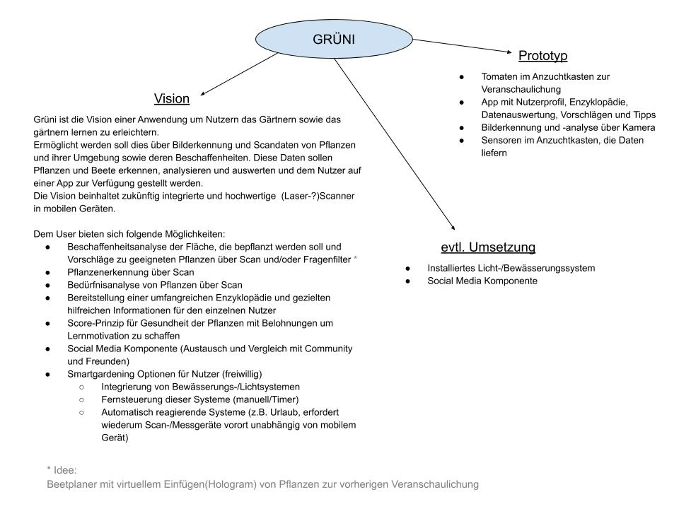

---
# Meta-Daten zum Dokument
title: Dokumentation zur App Grüni
author: Robert Ackermann, Hannes Dröse, Dennis Krischal, Livia Schumm
date: 03.08.2020
abstract: |
    Im Folgenden behandeln wir Anfänge, Entwicklung und Ergebnisse des Semester-Projektes "Grüni" im Rahmen des Medienprojekt-Moduls. Grüni ist die Vision einer Anwendung um Nutzern das Gärtnern sowie das gärtnern lernen zu erleichtern.
lang: de
---

# Die Idee

Die Idee einer Gärtnerhilfe-Anwendung entstand bereits Anfang April 2020 während des ersten Brainstormings. Im ersten Treffen des Moduls, am 20.04.2020 haben wir vier - Robert Ackermann, Hannes Dröse, Dennis Krischal und Livia Schumm - uns in einer Projektgruppe zusammengefunden. Am selben Tag hat unser erstes Webex-Meeting stattgefunden, in dem über verschiedene Ideen beratschlagt worden ist. Für die Aufgabenstellung mit dem Motto "Future Interfaces" sollen zwei Teilprojekte abgedeckt werden:

1. Die Entwicklung einer [Vision](#vision), also die Konzeption einer zukunftsweisenden intuitiven Interaktion mit digitalen Inhalten und deren Darstellung in Form eines Visionsvideos
2. Die Entwicklung eines [Prototyps](#prototyp) dieser Vision, sprich die Ausarbeitung einer interaktiven Anwendung

Unsere Projektidee soll also sowohl innovativ als auch in Teilaspekten umsetzbar sein, jedoch sollten wir uns vorerst mehr auf die Vision als auf den Prototypen konzentrieren. Es entstand eine Auswahl folgender Projektthemen:

- Gardening - App zum Gärtnern lernen, unterstützt und lehrt das Gärtnern
- Kontaktloses Bezahlen und papierlose Kassenbons
- Verwaltung - Online Identitätsfeststellungen, Digitale Formulare
- Antlitzdiagnostik - Apps analysieren den Gesundheitszustand, appgestützte Ferndiagnose mit Ärzten

Der gemeinsame Favorit hat sich im Gespräch jedoch schnell abgezeichnet und nach einer kurzen Themenabstimmung mit den betreuenden Dozenten hat die Richtung in den Gardening-Bereich festgestanden.

##	Recherche

Der nächste Schritt, nachdem eine Projektrichtung festgesteckt worden ist, ist die Recherche in diesem Bereich. Im Fall des Gardenings stellen sich vor allem drei Fragenfelder:

1. Wie sieht Gärtnern aktuell überhaupt aus, woran besteht Bedarf und in welche Richtung gehen die Trends der Zukunft?
2. Welche Apps, Anwendungen und Projekte gibt es bereits und welche sind in der Entwicklung?
3. Wie sehen die technischen Möglichkeiten aus? Welche Sensoren, Messtechniken o.ä. werden in der Landwirtschaft gebraucht oder sind im Garten einsetzbar?

**Anmerkung:**

Im Folgenden werden nur einige, wesentliche Aspekte dieser Recherche zusammengetragen, weitere gesammelte Informationen und Artikel finden sich in unserem Projekt unter den Recherchen im Management-Tool Asana.[^asana1]

[^asana1]: Allgemeine Recherche und Trends: <https://app.asana.com/0/1172859492234369/1172897938417709>  
Pflanzen Apps: <https://app.asana.com/0/1172859492234369/1172897938417707>  
Sensoren und Messtechnik: <https://app.asana.com/0/1172859492234369/1172859492239381>  

### Trends und aktuelle Entwicklung des Gärtnerns

Dass die Beliebtheit von Gärten, Pflanzen und Natur steigt, merkt schon alleine, wer sich im eigenen Umfeld umsieht. Zahlreiche Artikel, Blog- und Social Media-Beiträge zeigen die Trends des **Urban Gardening**, des **Urban Jungles**, des **DIY** (Do It Yourself) auf.

Laut dem Zukunftsinstitut[^1] ist die Zahl der Menschen mit Garten oder Balkon in Deutschland zwischen 2007 und 2011 von 50 Millionen auf 55 Millionen gestiegen. Ebenso sinkt das Durchschnittsalter von Kleingarten-Pächtern stetig ab.[^3] Der Trend geht hin zur Begrünung von Gärten, Balkonen, Terrassen, zur Gründung sowie Nutzung von Gemeinschafts- und Nachbarschaftsgärten – vor allem bei der naturhungrigen Stadtbevölkerung. Die Gartenbranche stellt sich langsam auf eine **neue, jüngere Zielgruppe** ein. Die steigende Beliebtheit des Gärtnerns jeglicher Art liegt unter anderem im Ausgleich, den es zum stressigen Stadtalltag bieten kann, aber auch in seiner guten Vereinbarkeit mit dem Nachhaltigkeits-Trend. Verschiedene Faktoren lassen haufenweise individuelle und clevere Ansätze entstehen. Die Nachfrage nach Bio-Produkten und Nutzpflanzen und dafür möglichst einfachen aber autonomen Systemen ist groß.

Der Platzmangel in Städten verlangt z.B. nach vertikalen Lösungen:

- "Pflanzetageren": Versetzt angeordnete, kleeblattförmige Gefäße, die sich hoch stapeln lassen  
- "Minigarden": vertikales Pflanzsystem, Begrünung von Wänden oder kompletter Balkonbrüstung  
- "Skyplanter": Pflanzen wachsen in einer Art umgedrehtem Blumentopf von der Decke herab nach unten

Doch nicht nur das Interesse in Richtung zurück zum Ursprünglichen – zur Natur – ist groß, sondern auch innovative, konnektive Lösungen sind gefragt, die das Leben in Haus und Garten durch **smarte Technik** vereinfachen. In seinem Vortrag auf dem DIY Garden Summit 2017 in Berlin[^3] erklärt Christian May, Geschäftsführer von Kärcher, wie ein Tag im Garten des Jahres 2030 aussehen könnte:

> Während eines gemütlichen Frühstücks in der Sonne auf meiner Terrasse fällt mein Blick auf den Grill: Ihn umgeben unschöne Überbleibsel vom gestrigen Grillfest. Doch dem Hochdruckreiniger fehlt der spezielle Aufsatz für Rußflecken. Schnell ist die passende Vorlage gefunden und kurz darauf druckt der 3D-Drucker den fehlenden Aufsatz aus und die Arbeit kann beginnen.
> Da ich nun schon einmal im Garten bin, kümmere ich mich auch gleich um meine Blumenbeete. Während ich mich umschaue, zeigen mir einzelne Pflanzen auf meiner Smart-Brille an, dass sie nicht genug Sonne bekommen und umgepflanzt werden müssen.
> Am Nachmittag ist es Zeit für meinen Videokurs zum Thema Pflanzen, Pflegen und Ernten seltener Gemüsesorten – meinem Steckenpferd. Meine Expertise auf dem Gebiet teile ich gerne und inzwischen lauschen meinen interaktiven wöchentlichen Livestreams interessierte Hobbygärtner und Landwirte aus Kanada, Südafrika und Japan, die mich wiederum an ihrem Wissen teilhaben lassen.
> Am Abend bin ich mit Freunden zum Abendessen verabredet. Während der Vorspeise bekomme ich eine Nachricht: Die Sonne brannte heute den ganzen Tag und meine Pflanzen sind durstig. Jetzt, wo es langsam schattiger wird, ist der perfekte Zeitpunkt, meine Rosen zu bewässern. Per Knopfdruck bestätige ich, das automatische Bewässerungssystem legt los und ich kann mich wieder in Ruhe meiner Vorspeise widmen.

Aus diesem Beispiel gehen gleich mehrere mögliche Zukunftsaspekte hervor:

- konnektive Lösung mittels 3D Drucker zum Drucken von Ersatzteilen und Hilfsmitteln
- Smart-Brille erfasst Umgebungs- und Pflanzenzustand (Bewässerung, Sonnenbelichtung etc.)
- Austausch von Wissen über Vernetzungskomponente
- smarte Auswertung verschiedener, zusammenspielender Informationen (Gießzustand der Pflanzen plus Ermittlung des optimalen Zeitpunktes)
- automatisierte Systeme zur Versorgung (in dem Fall Bewässerungsanlage per Knopfdruck)

[^1]: Artikel "Die Zukunft ist ein Garten" - <https://www.zukunftsinstitut.de/artikel/wohnen/die-zukunft-ist-ein-garten/>
[^2]: Artikel vom 13.07.2017: "Warum wir im Schrebergarten unser Glück finden" - <https://www.bento.de/nachhaltigkeit/schrebergarten-warum-gaertnern-hip-ist-a-00000000-0003-0001-0000-000001502495>
[^3]:Artikel vom 22.11.2017: "Blick in die Zukunft: So leben wir im Garten 2030" - <https://taspo.de/kategorien/blick-in-die-zukunft-so-leben-wir-im-garten-2030/>

###	Technisch relevante Daten der Pflanzenwelt

Aufwendige und smarte Technik wird zurzeit vor allem im Großanbau-Rahmen, also in der Landwirtschaft, eingesetzt. Das **Digital Farming** hat sowohl in der Tierindustrie als auch im Anbau Einzug gehalten - die Landschaft steckt mitten drin in der Digitalisierung, neudeutsch: **"Smart Farming"**.[^farming1] Für die Landwirte bietet das sowohl Vor- als auch Nachteile, im Hinblick auf ein interaktives Gardening-Projekt sind aber vor allem die technischen Möglichkeiten relevant und was man aus ihrem Einsatz in der Landwirtschaft lernen kann. Allgemein dient Smart Farming der Optimierung von Planung, Effizienz und Ertrag.

**Precision Farming:** Komplettangebote von IT-Konzernen zur Optimierung der Pflanzen für die Weiterverabeitung (z.B. Berechnung des Abstands zwischen Pflanzen, damit sie die richtige Größe bekommen). Mithilfe von Sensoren auf dem Feld und in den Böden, vernetzten Maschinen und entsprechenden Analyse-Softwares, die zusätzlich benötigte Daten, wie Geo- und Wetter-Analysen, mit einbeziehen wird für eine großflächig abdeckende, informationstechnische Infrastruktur gesorgt. [^farming1]

Der **Einsatz von Drohnen** und **Auswertung von Satellitenbilder** hilft bei der Planung von Aussaat, Pflege und Ernte:

- BayWa-Drohnen ermöglichen beispielweise eine automatische Schädlingserkennung und -bekämpfung.[^farming3]
- Das Copernicus-Programm beinhaltet zum Beispiel Satellitenfernerkundungssysteme, das verschiedene Daten (Pflanzenstrukturen und Bodenbewegungen, Landbedeckung und Landnutzung) zum optimalen Düngermanagement sammelt.
- Positionsgenaue Regenradar-Apps dienen der optimalen Bewässerung von Feldern.[^farming3]

**Farm Managment**: Eine datengestützte, automatische Dokumentation spart Zeit. In Zukunft soll sogar nur noch geringfügig menschliche Arbeit vonnöten sein indem Maschinen direkt mit Maschinen kommunizieren.[^farming2]

Herausforderungen für die IT stellen sich hauptsächlich durch die Verwaltung enormer Datenmengen und deren Austausch über das mobile Netz. Gerade in den ländlichen Regionen, in denen Landwirtschaft stattfindet, stellt eine nicht vorhandene Flächendeckung von Netzzugang mit hoher Bandbreite[^farming3] teilweise ein Problem dar.

Zusammenfassend kann man aus dem Beispiel der Landwirtschaft folgende Daten als relevant für jegliche Form von Pflanzenanbau ableiten:

- Bodenbeschaffenheit (Zusammensetzung, Nährstoffe, Durchlässigkeit, Bodenfeuchtigkeit)
- Zustandsanalysen (Größe, Abstände, Schädlinge)
- Wetterdaten (Belichtung, Bewässerung, Unwetter)
- Geo-Daten (Pflanzenstrukturen und Bodenbewegungen, Landbedeckung und Landnutzung)
- Pflanzendaten (Wissen zur Pflanzenart und ihren Bedürfnissen)

Um diese Daten zu gewinnen bedarf es verschiedener Quellen. Für präzise, lokale Daten bedarf es oft festinstallierter Hardware (Sensoren), die sich wohl nicht bewährt hat.[^farming1] Der Trend entwickelt sich immer mehr in Richtung mobiler Analysen über Roboter und Drohnen. Je größer der Anbau-Rahmen desto mehr lohnen sich logischerweise großangelegte, technische Systeme. Die Frage ist nun wie sich solche Systeme flexibel genug an den Privatgebrauch und dessen technische Gegebenheiten anpassen lassen, um auch für diese Zielgruppe lohnenswert zu sein.

Mit dieser Frage beschäftigen sich auch Garten-Dienstleister, Unternehmer und Start-Ups - welches Angebot dafür bereits besteht behandelt der nächste Abschnitt.

[^farming1]: vgl. Artikel vom 10.11.2019, Link: <https://www.deutschlandfunk.de/digitalisierung-der-landwirtschaft-daten-saeen-daten-ernten.740.de.html?dram:article_id=462957>
[^farming2]: vgl. Artikel vom 21.07.2020, Link: <https://www.computerwoche.de/a/was-sie-ueber-landwirtschaft-4-0-wissen-muessen,3544215>
[^farming3]: vgl. Artikel vom 23.06.2017, Link: <https://biooekonomie.de/digitale-landwirtschaft-it-fuer-acker-und-stall>

###	Bereits bestehende Projekte

Interaktive, technische Anwendungen im Bereich des Gardening gibt es auch für die Otto-Normalverbrauchenden bereits reichlich in verschiedenen Ausführungen, wenn auch nicht in so ausgefeiltem Stil wie in der Landwirtschaft. Meist greifen sie eine unterschiedliche Auswahl an den im vorigen Abschnitt erläuterten Aspekten auf. Man kann sie anhand der Funktionalität jedoch grob unterteilen in:

- visualisierende Planungs-Tools
- einfache Erinnerungs-Anwendungen
- Pflanzenerkennungs-Apps und
- smarte, teils automatisierte Beete.

Produkte und Projekte gibt es dazu viele. Im Folgenden werden zur Verdeutlichung jeweils einige Beispiele vorgestellt.

#### Visualisierungs-Software

- **Garten-Planer:**
  Beispiel "Home Design 3D Outdoor & Garden"[^homedesign] – Eine App, die einen virtuellen Rundgang im eigenen Garten ermöglicht.
- **Beet-Planer:**
  Beispiel "Alphabeet"[^alphabeet] – Wer sich hier anmeldet, kann zunächst einmal seine Beete digital anlegen. Je nach Größe wird vorgeschlagen, welche Pflanzen wo angebaut werden sollten und auch zueinander passen. Ist das Beet fertig geplant, wird automatisch eine Aufgabenliste erzeugt, die per Mail an die täglich nötigen Arbeiten erinnert und online bei Erledigung abgehakt werden können: Tomaten ausgeizen, Unkraut entfernen, Stecklinge ziehen, Möhren abdecken, Gießen und vieles mehr.

Hierbei stehen also drei Aspekte im Vordergrund: Planen, Umsetzen und Lernen anhand der Infobibliothek.

[^homedesign]: Link: <https://en.homedesign3d.net/2018/10/09/update-v4-2-outdoor-garden/>
[^alphabeet]: Link: <https://www.alphabeet.org/>

#### Gieß- und Pflegeerinnerungs-Apps

Dabei handelt es sich um reine Organisations-Tools, in denen man Aufgaben verwalten und Erinnerungen erstellen kann. Sie ermöglichen außerdem Zugriff auf Datenbanken, die dem User nützliche Informationen zu seinen Pflanzen bieten.

Beispiele für diese Art App sind:

- Gardenia (iPhone // Android)
- myPlants - Manage Tool und Reminder (iPhone // Android)
- PeppyPlant (iPhone)
- Happy Plant (iPhone)
- Plant Watering Reminder (iPhone)
- Plant Diary (Android)

#### Pflanzenerkennungs-Apps

Die Hauptfunktion solcher Apps ist die Erkennung von Pflanzen anhand von Fotos. Sie verfügen ebenso über eine Pflanzenenzyklopädie, aus der der User weitere Informationen erlangen kann. Außerdem wird ein Austausch über eine Community ermöglicht, über die die App hauptsächlich funktioniert – je größer und aktiver die Community desto größer die Datenbank, desto präziser also auch die Bilderkennung.

Beispiele für diese Art App sind:

- PictureThis[^picturethis]
- PlantNet[^plantnet]
- PlantSnap[^plantsnap]
- Garden Flower Identification[^gardenfloweri]

[^picturethis]: Link: <https://www.picturethisai.com/>
[^plantnet]: Link: <https://plantnet.org/en/>
[^plantsnap]: Link: <https://www.plantsnap.com/>
[^gardenfloweri]: Link: <https://apps.apple.com/us/app/garden-flower-identification-plant-identifier-free/id1128290219>

#### Smarte, automatisierte Beete

Beispiel: Start-Up **IP Garten**[^ipgarten]
 
Hierbei handelt es sich um ein Dienstleistungsunternehmen, bei dem man Beete buchen kann. Diese werden live überwacht mittels Kameras und Feuchtigkeitssensoren. Interagiert werden kann von zuhause aus über eine virtuelle Welt auf dem Computer. Eine ferngesteuerte Bewässerung ist für den Kunden möglich, alle weiteren Gärtner-Leistungen werden hinzugebucht und von Mitarbeitern durchgeführt. Der Ertrag des gebuchten Beetes kann nach der Ernte abgeholt oder geliefert werden. 

Beispiel: **Urban connected Gardening mit smartem Hochbeet**[^smartbeet]

Dieses Projekt entstand durch eine Kooperation aus "Smartgreen Solutions" und "T-Mobile Austria". Im Vergleich zum ersten Beispiel ist dieses Smartbeet-System autark. Es wird mit Regenwasser und Solarenergie betrieben. Ausgestattet mit Sensoren, wird eine Vielzahl an Faktoren gemessen: Temperatur, Feuchtigkeit, Sonneneinstrahlung, Stromverbrauch, Wasserdurchfluss etc. Außerdem hat Smartgreen Solutions eigens eine elektronische Steuereinheit entwickelt, um das Beet automatisch reagieren zu lassen. Diese Steuereinheit sendet zudem Daten über T-Mobiles IoT-Box an die Smartgreen-Cloud, wodurch der User sie auf der eigenen App abrufen und kontrollieren kann. Die IoT-Box wiederum versorgt die Steuerung mit Daten, wie zum Beispiel Wetterdaten.

[^ipgarten]: Link: <https://ipgarten.de/>
[^smartbeet]: Quelle: <https://computerwelt.at/news/iot-macht-aus-hochbeeten-smartbeete/>

**Smart und automatisiert** bedeutet also immer, dass eine gewisse Hardware-Ausstattung vonnöten ist und muss lokal installiert sein. Je aufwendiger die Ausstattung, desto mehr Möglichkeiten ergeben sich für das Beet. 

**Anmerkung:**

Eine zusammengetragene Liste weiterer Crowdfunding Projekte zu dem Thema findet sich in unserem Projekt unter den Recherchen im Management-Tool Asana.[^asana2]

[^asana2]: Link: <https://app.asana.com/0/1172859492234369/1172957097729748>

##	Festlegung des Projektrahmens   

Aufgrund der Fülle an Themengebieten und bereits existierenden Projekten, soll nun die Vision und ihr potenzieller Wirkungsraum von den recherchierten Projekten abgegrenzt werden.

Es soll sich um kein landwirtschaftliches Projekt, sondern um eine Anwendung für den Privatgebrauch handeln. In diesem Rahmen soll sie jedoch so universell wie möglich einsetzbar sein. Es stellt sich also die Frage, wie sich möglichst flexible, mobile Systeme mit einer möglichst präzisen, lokalen Datengewinnung gestalten lassen. Sind Sensoren unablässig oder lassen sie sich beispielsweise durch Scan-Geräte ersetzen? Was können Scanner zurzeit und was möglicherweise in der Zukunft? Und welche Geräte sind in welchem Rahmen einsetzbar?

Der erste Schritt, um vor dem Hintergrund dieser Fragestellungen den Projektrahmen zu finden, ist die Erstellung von Zielgruppen Personas. Auf deren Basis können dann die Anforderungen für das Visions-Produkt entstehen.

### Erstellen von Zielgruppen Personas

#### Zielgruppe allgemein

Die allgemeine Zielgruppe umfasst Privatpersonen, die Interesse am Gärtnern haben. Dadurch, dass Gardening ein Trend-Thema ist, handelt es sich also um eine relativ große, breit gefasste Zielgruppe. Im Fokus soll jedoch das Gärtnern Lernen stehen. Dies soll durch Technik unterstützt werden, die beim User bereits vorhanden ist. Der Prozess des Lernens soll dabei durch angeleitete Tätigkeiten am realen Objekt geschehen. Es handelt sich also um kein virtuelles Lerntool.

#### Beispiel-Personas

Die allgemeine Zielgruppe könnte Personen mit folgenden Steckbriefen enthalten:  

**Jonas:**

- 24 Jahre alt
- Student
- interessiert an Nachhaltigkeit und grünen Themen
- in der Stadt aufgewachsen
- bisher keinen Bezug zum Gärtnern oder zu Pflanzen, aber Sehnsucht nach Grün und Gartenidylle
- hat also kaum Erfahrung damit, möchte es aber Lernen und Ausprobieren
- wenn es ihm gefällt, macht er vielleicht mehr in die Richtung
- ist technisch komplett ausgestattet mit diversen gängigen Geräten (mobil, aber auch stationäre, smarte Assistenten)

**Martina:**

- 26 Jahre alt
- hat bereits Erfahrung mit Pflanzen
- möchte mehr lernen und Garten-Profi werden

**Mike:**

- 34 Jahre alt
- begeisterter Gärtner mit sehr großem Garten und vielen Pflanzen
- kann sich gar nicht wirklich um alles kümmern und braucht Hilfe dabei

Der Fokus für das Visionsvideo soll vor allem auf Jonas festgelegt sein.

###	Features - Vision vs. grobe Richtung Prototyp {#features1}

Aus der Zielgruppe ergibt sich die Schlussfolgerung ein möglichst Hardware-armes Produkt zu entwickeln, das universell für viele Nutzer einsetzbar ist. Das heißt auf technische Geräte zu setzen, die bereits in jedem Haushalt vorhanden sind. Zurzeit ist dies unbestritten das Smartphone, aber auch erweiternde SmartHome-Geräte halten immer mehr Einzug. Auch wenn sich User Interface und technische Ausstattung stetig wandeln, wird uns auch in Zukunft das Smartphone weiter begleiten. Auf diese Annahme setzt Grüni. Die folgende Grafik zeigt den Stand von definierten Soll-Anforderungen vom 29.04.2020 (vgl. mit späterer [Darstellung im Video](###Interaktionsgestaltung) sowie [Umsetzung beim Prototypen](##Umsetzung)):

Zusätzlich zu der technischen **Ausstattung zur Analyse** gibt es ebenfalls Hardware zur **Versorgung** der Pflanzen. Dies soll mit der Anwendung Grüni zwar möglich sein, aber freiwillig, da weitere Geräteinstallationen dafür nötig sind. Der Lern- und Informations-Aspekt stehen im Vordergrund.

Für den Prototypen war jedoch bereits zu diesem Zeitpunkt klar, dass wir nicht auf externe Sensoren verzichten werden können und auch der Wirkungsraum spezifisch eingegrenzt sein wird. Dazu allerdings erst mehr unter dem Punkt [Prototyp](#prototyp).

##	Herausforderungen in der Projektfindungssphase

Eine große Herausforderung hat in der Masse an Recherche-Material bestanden, welches durchgelesen und aussortiert werden musste.
Aus dieser Flut hat sich die genaue Definition, was denn nun genau mit der Grüni Anwendung erreicht werden soll, als schwierig herausgestellt. Ebenso ist die klare Abgrenzung zu den vielen anderen Projekten schwer gefallen.
