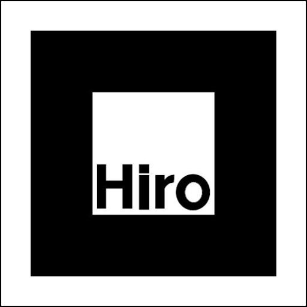

# Der Prototyp {#prototyp}
(Allgemeine Beschreibung: Kasten, Sensoren, App)
--
## Recherche und erste Tests
### Sensoren

Zum Speichern und Verarbeiten der Sensordaten wird ein Raspberry Pi 4 benutzt, da dieser der Projekt-Gruppe bereits zur Verfügung stand. Bei den Sensoren war daher die Auswahl eher begrenzt. 

| Funktion | Verwendete Komponente | Kommentar | 
|--------|--------|--------|
| Lichtmessung | Lichtsensor „BH1750“ | wandelt bereits auf der Platine die Analogsignale in Digitalsignale |
| Temperaturmessung  | Sensor „DHT22“ | wandelt ebenso bereits die Signale sodass diese ohne zusätzliche Bauteile vom Raspberry Pi gelesen werden können |
| Bodenfeuchtigkeitsmessung | „Capacitive Stil Moisture Sensor v2.0“ | wurde von Hardwareexperten der FH empfohlen  → liefert unter den Feuchtigkeitssensoren die präzisesten Daten |
| Signalverarbeitung des Feuchtigkeitssensors | Analog-Digital Wandler „MCP3008“ | wurde ebenso gewählt aufgrund der Empfehlung führender Hardwareexperten der FH |

Zum Testen und Nutzen der Sensoren wurde ein kleines Python Script geschrieben, dass sowohl die Sensoren anspricht als auch deren Daten im Json-Format speichert. 

**Anmerkung zur Abgrenzung zwischen dem Gruppenprojekt "Grüni" und dem IT-Praxisprojekt von Dennis Krischal:**  
Die Projekte überschneiden sich in genau einem Punkt, da es sich angeboten hat für beide die gleiche Hardware zum Auslesen der Sensoren zu benutzen.

### AR

Marker: 

---
## Konzeption
### Ablauf und Visualisierung

https://drive.google.com/drive/folders/1b-I-Ynj_gnzshX2nmXE3F7P9P4ZDIKlV
### Architektur
https://drive.google.com/drive/folders/1axUoBa-6V8m4xlXnIqG_9iJej61XTZWL

Abgrenzung zum IT-Praxisprojekt Dennis

---
## Umsetzung
vlg. mit Grafik zur [Richtung des Prototyps](###features1)

Verweis zum Git Repository (+ Installationshinweise?)

### Video (?)

--
## Fazit zum Prototypen
### Aufgetretene Schwierigkeiten
### Verbesserungsmöglichkeiten

# Schlusswort
(Organisation im Team - Verweis auf Asana/Protokolle, Arbeitsaufteilung, Was konnten wir aus vergangenen Modulen mitnehmen und was haben wir Neues gelernt?)
