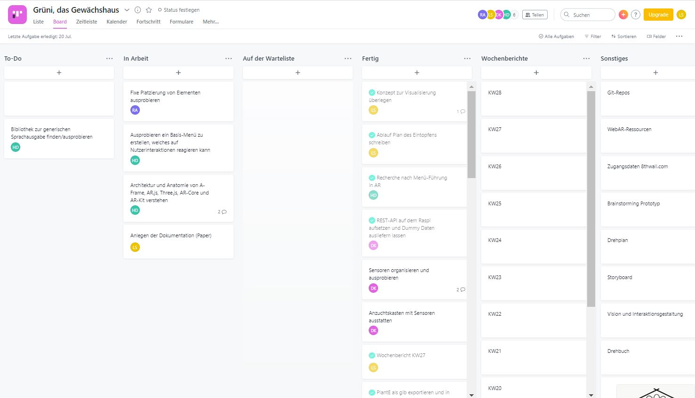

# Fazit  {#fazit}

Das Projekt Grüni hat das Team auf sehr konstante Art und Weise durch dieses Semester begleitet. Die Projektidee ist schnell gefunden gewesen. Die Begeisterung des gesamten Teams für den Themenbereich eines Gardening-Projekts ist sehr förderlich gewesen, um stetig daran weiter arbeiten zu können.

Auch Organisation, Absprache und Aufgabenverteilung haben sehr gut funktioniert. Dies ist zum großen Teil den wöchentlich stattfindenden Modulveranstaltungen zu verdanken und möglicherweise auch dem Rahmen des (Corona geschuldeten) Online-Semesters. Die durchgeführten Webex-Meetings sind anschließend immer direkt intern weitergeführt worden und sind stets erstaunlich produktiv gewesen. Über Google Drive, Google Documents und ähnliche Tools ist gemeinsames Brainstorming, Festhalten von Ideen, Arbeiten an Dokumenten und Anforderungen konzentriert umsetzbar gewesen.

Als Projektmanagement-Tool ist Asana verwendet worden: Unter dem Link <https://app.asana.com/0/1172859492234369/board> lässt sich die Projektentwicklung nochmals im Detail nachvollziehen. Dort finden sich unter anderem sämtliche, geführten Protokolle unter dem Punkt Wochenberichte wieder, inklusive der Aufgabenverteilung im Team. Erstellte, ausgetauschte Dokumente und Dateien sind in den jeweiligen Aufgaben verlinkt und finden sich gesammelt im Google Drive Projekt-Ordner unter dem Link <https://drive.google.com/drive/folders/10xpkQQMSEUjZaZLw7HL2MjYE71AiZr6m?usp=sharing> wieder.

Der Arbeitsaufwand für ein 8CP-Modul ist selbstverständlich nicht in ein paar Tagen zu bewältigen gewesen. Das Projekt hat sehr viele verschiedene Aufgaben und Disziplin umfasst:

- die Entwicklung einer Produktidee,
- die Beschäftigung mit grafischen Nutzeroberflächen,
- Video-Dreh und -Bearbeitung,
- Animationen in Blender,
- das zusammenfügen von Real- und Animationsfilmteilen,
- Beschäftigung mit neuen, ungewöhnlichen Technologien (VR und AR im Webbrowser),
- das Entwickeln und Programmieren einer Anwendung mit vielen Teilaspekten (hardwarenah, server- und clientseitig)
- und zu guter Letzt LaTeX für das Erstellen der Dokumentation.

Vorteilhaft ist gewesen, dass viele Teile der Aufgaben nicht gänzlich neu gewesen sind, sondern einzeln bereits in vergangenen Modulen behandelt worden sind und das Team so aus bereits gesammelten Erfahrungen geschöpfen hat. Die Kombination aus so vielen Aufgaben stellt allerdings einen erhöhten Organisationsanspruch dar. Auch klassische Zeitfresser, wie z.B.Überlastungen beim Rendern, haben sich nicht gänzlich vermeiden lassen.

Dennoch ist eine schöne Vision für die Zukunft entstanden, die in einem spannenden Film visualisiert worden ist. Wer weiß, vielleicht hat schon bald jeder seinen kleinen PLANT-E zuhause und schöne grüne Beete, Töpfe und Balkone.

Leider ist das Ergebnis im Prototypen für das Team nicht sehr befriedigend ausgefallen, dadurch sind aber auch die Grenzen der aktuellen Technologien deutlich geworden. Gerade für den Blick in die Zukunft ist das Scheitern unabdingbar und die Grundlage für Fortschritt und Entwicklung. Außerdem handelt es sich natürlich auch nur um einen Prototypen, der zeigen sollen, was heutzutage schon möglich bzw. noch nicht möglich ist.

# Anhang {#anhang}

*siehe Ordner "Anhang"*