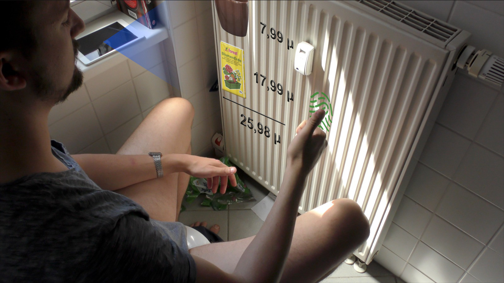

# Die Vision {#vision}

Der Weg durch die Projektfindungsphase führt nun also zur Anwendung “Grüni”. Grüni ist ein universelles Hilfstool für Pflanzen, welches im Haus oder Garten Einsatz findet. Sie beherrscht sehr umfangreiche Analysen, Simulationen und Funktionalitäten rund um das Gärtnern. Dabei ist die Größe des Topfes, Beetes oder Gartens sowie die Auswahl der Geräte, auf denen die App funktioniert, komplett variabel und frei. Es kommen sehr ausgefeilte Arten der holografischen Visualisierung zum Einsatz, bis hin zu einem personifizierten Gartengehilfen – PLANT-E. Wobei PLANT-E selbst keine Arbeiten verrichten kann, sondern als holografischer Assistent den Nutzer vor allem durch Prozesse (Eintopfen, Umtopfen etc.) führt oder Erinnerungen gibt.

## Geplante Eigenschaften und Features der Zukunftsvision

- Geräteunabhängigkeit  - App läuft auf stationären Geräten (z.B. Echo-Dots), mobilen Endgeräten (z.B. Smartphone, Tablet)- Geräteübergreifend
  - Messungen von einem Gerät (steht bei den Pflanzen)
  - Mitteilung des Nutzers über ein anderes Gerät (welches ihm gerade am nächsten ist)
- Nutzung in verschiedensten Umgebungen
  - sowie innerhalb als auch außerhalb des Hauses
  - ein paar Töpfe / ein Beet/ ein ganzer Garten 
- Analyse der Umgebung via Scan
  - geeignete Orte für die Pflanzen finden anhand ihrer Art und deren Bedürfnissen
- Beetplanung / Simulation des Pflanzenwachstums innerhalb einer gegebenen Umgebung
  - holografische Visualisierung von Pflanzen an entsprechenden Stellen inklusive Simulation wie sich die Pflanze dort entwickeln würde
- Pflanzenerkennung
  - Klassifizierung von Pflanzen und Samen via Scan 
- Bereitstellung von Informationen zur Pflanze
- Bestimmung des Zustands der Pflanze
  - Alter, Bewässerung, Bodenzustand, Lichtverhältnisse, Reifegrad der Früchte usw.
- Visualisierung dieser Zustandsinformationen (z.B. mit einer Gieß- bzw. Bewässerungsanzeige)
  - holografisch, symbolisch, auditiv
- Erinnerungsfunktion z.B. ans Gießen, Umtopfen, Rausstellen (z.B. in Form von PLANT-E)
- Vorschläge und Produktempfehlungen
  - entsprechend der aktuellen Bedürfnisse der Pflanzen werden die benötigten Tools und Komponenten direkt zur Bestellung angeboten
- der Lehrmeister **PLANT-E**
  - Personifizierung des Computers für den Menschen
  - Tipps Erinnerungen und Co. werden dem Nutzer über PLANT-E mitgeteilt
- Fingerabdruck-Scan
  - zum Autorisieren von Transaktionen
- Gestenerkennung
  - Greifen (zum Auswählen), leichtes Nicken, Rahmen für einen Schnappschuss setzen
- Community-Komponente / Sharing-Funktion
  - Möglichkeit die eigenen Pflanzen mit den Freunden zu teilen, fotobasiert

## Videovorbereitungen

### Drehbuch

Der erste Schritt zur Filmkreation ist die Überlegung gewesen, welche Aspekte der Vision Grüni als Produkt dargestellt werden sollen. Da der Umfang der Visionsidee sehr groß und variabel ist, ist die Handlung auf eine bestimmte Zielgruppe festgelegt worden - die im festgelegten Projektrahmen definierte Zielgruppe “Jonas”. Schon bei der ersten Version des Drehbuches ist direkt klar geworden, wer die Rolle dieser Zielgruppe treffen würde und so hat die Wahl unseres Hauptdarstellers schnell festgestanden. In diesem Zuge ist der Name “Jonas” auf “Christian” geändert worden. Christian
startet entsprechend seiner Persona mit keinerlei Grundwissen, kommt zufällig an Gärtner-Material und wird daraufhin auf die Anwendung gestoßen.

Dramaturgisch findet die Entwicklung gleichermaßen zwischen Mensch und App statt.
Die Darstellung der App geschieht hauptsächlich über PLANT-E, der dabei wie ein virtueller Lehrer ist und Christian das Gärtnern im Rahmen seiner Ausstattung und Möglichkeiten vorort beibringen soll.

Inspiriert war die Idee PLANT-Es ursprünglich vom Roboter WALL·E aus dem Film “WALL·E – Der Letzte räumt die Erde auf”, daher auch der Name. Anfänglich sollte PLANT-E auch in seiner Art der Kommunikation an WALL·E angelehnt sein, sprich er sollte möglichst wenig sprechen, sondern hauptsächlich über Gestik und Mimik kommunizieren. Realistisch war dies für die Umsetzung seiner Funktion als Ratgeber und Lehrmeister allerdings nicht, darum ist die Entscheidung doch auf Dialoge gefallen.

Weitere im Verlauf der Entwicklung für die Handlung festgelegte Aspekte des Filmes:

- (Alexa) Echos = Analysegerät (Scan)
  - Wohnung und Balkon bei Christian
  - Kommunikation zwischen Christian und Schwester
- Handy = Projektor
  - Andeutung von Variabilität durch Nachbarsgärten – Andeutung einer Community durch Posts

Die Endfassung des Drehbuches findet sich im [Anhang](#anhang).[^drehbuchEnd]

[^drehbuchEnd]: Alle Versionen des Drehbuches finden sich im Google-Drive Ordner unter dem Link: <https://drive.google.com/drive/folders/1toOwAzorJRI8cY0EzBIM56n-LDfFUXsK>

### Interaktionsgestaltung und UI-Design

Bei der Entwicklung des Drehbuches wurde bereits schnell deutlich, dass die Interaktionsgestaltung im Fokus der Handlung stehen sollte. Wie die Features der Vision in der Interaktion aussehen, zeigt sich in den folgenden Designentwurf-Skizzen (Stand 26.05.2020) zur Umsetzung in den Szenen:

#### Szene 2

- Verarbeitung von Sprachbefehlen
- Scannen des Raums, Identifizierung der Gegenstände → Erkennung von Anzuchtkasten und Samen:
  - Stil-Inspiration: <https://www.youtube.com/watch?v=3HbkcRAQhew>

- Visualisierung der Pflanzen:

- Gestenerkennung → “Greifen” der Pflanzen, um mehr Informationen zu erhalten

- Anzeige weiterer Informationen über die Pflanzen

- Analyse des Raumes und Erkennen eines guten Standortes für den Anzuchtkasten

- Gestenerkennung → Unsicherheit Christians wird erkannt und Hilfe angeboten

#### Szene 3

- Visualisierung des personifizierten Helfers → PLANT-E
- Führen durch einen Ablauf (Eintopfen) mit Hilfe von PLANT-E
- dabei wird der Fortschritt vom System erkannt und PLANT-E gibt dazu entsprechendes Feedback
- Gießanzeige → zusätzliche Visualisierung zur Unterstützung, die unabhängig von PLANT-E ist 

#### Szene 4

- Erinnerungsfunktion → in dem Fall zum Umtopfen
- Analyse der benötigten Utensilien und Angebot, dieselbigen zu bestellen
- Fingerabdruck-Scanner zur Autorisierung der Bestellung

#### Szene 5

- Führen durch einen Ablauf (Umtopfen) → wird nur in Grundzügen gezeigt, da das bereits vorgekommen ist
- Sharing-Funktion → Fotografieren und Teilen mit den Freunden

#### Szene 6

- Analyse des Pflanzenzustands (Reifegrad der Früchte) → Feedback und Handlungsempfehlung wird mit Hilfe von PLANT-E dem Nutzer mitgeteilt
- Beetplanung → wird angedeutet mit den vielen neuen Töpfen auf dem Balkon
  - *Anmerkung*: konnte aus Platzmangelgründen am Drehort nicht umgesetzt werden
- Sharing-Funktion → Funktion wird wieder aufgegriffen für die Endansicht
- zeigt den Einsatz der App in verschiedenen Garten-, Beetgrößen und Szenarien
- im Endeffekt nicht direkt dargestellt ist die mögliche Erweiterung auf automatisierte Versorgungssysteme (z.B. Bewässerung), durch die Karten-Endansicht wird aber angedeutet, dass es im Allgemeinen noch weitere Nutzungsmöglichkeiten gibt

### Storyboard und Drehplan

Mit unseren Erfahrungen aus vorherigen Videoprojekten war klar, dass eine gute Vorbereitung beim Dreh selber viele Unklarheiten und damit Zeit ersparen. Verschiedene Anweisungen für den Dreh wurden bereits bei der Erstellung des Drehbuches notiert, zum Schluss aber getrennt in einem genauen Ablaufplan für den Dreh zusammengetragen. Dieser befindet sich im [Anhang](#anhang).

Ebenso wichtig ist es gewesen, vor allem aus platz- und lichttechnischen Gründen, vorausgehende Aufnahmetests am Drehort zu machen und daraufhin die Erstellung eines Storyboards durchzuführen. Auch dieses befindet sich im [Anhang](#anhang).

In einer weiteren Version des Drehbuchs[^drehverweise] sind Verweise der verschiedenen Kameraeinstellungen in Bezug auf die chronologische Handlung sowie auf gekennzeichnete Abschnitte des Drehplans zu finden. Diese Verweise sind für den späteren Schnitt nötig gewesen aufgrund der Tatsache, dass in manchen Szenen mehr Kameraeinstellungen als zur Verfügung stehende Kameras geplant gewesen sind. 

[^drehverweise]: vgl. Link: <https://drive.google.com/drive/folders/1toOwAzorJRI8cY0EzBIM56n-LDfFUXsK>

## Der Dreh

Der Drehtag war der 21.05.2020. Nach gründlich getroffenen Vorbereitungen waren bereits nach ca. 6 Stunden alle Szenen aufgenommen und der Dreh damit abgeschlossen.

**Akteure am Drehtag mit Funktion:**

- Christian Weniger: Hauptdarsteller in der Rolle des Christians
- Hannes Dröse: Tonaufnahme / Sprecher für die Rollen von PLANT-E und Alexa
- Robert Ackermann: Motion / UI Vision
- Dennis Krischal: Kamera / Storyboard
- Livia Schumm: Setdesign / Drehplan

## Nachbearbeitung des Videomaterials

### Schnitt und Ton

Der hauptsächliche Zeitaufwand dabei ist definitiv in das Sortieren und Zusammenfügen von Bild- und Tonaufnahmen geflossen, sprich den Rohschnitt. Für die Stimmen von PLANT-E und Alexa wurde der Ton gesondert aufgenommen, nachträglich mit Effekten bearbeitet und anschließend dem Video hinzugefügt. Zur Audio-Bearbeitung ist **Logic Pro X **verwendet worden.

Verwendet wurde das Schnittprogramm **Final Cut Pro**. Weitere Arbeitsschritte sind gewesen:

- Anpassung der Belichtung (die Lichtverhältnisse am Drehort waren suboptimal, was sich in der Qualität der Bildaufnahmen zeigte)
- das Erstellen einer Fotosequenz
- den Feinschnitt mit Unterlegung von Musik
- Zoom- und Übergangs-Effekte für die Schlusssequenz in der Kartenansicht
- Erstellen des Abspanns mit Credits und Quellen

**Verwendete Musik:**

- Gianmara Testa - Gli Amanti di Roma
- Adana Twins - Nobis

**Verwendete Schrift:** Amatic SC

Das Zwischenergebnis des Videos ohne animierte Komponenten findet sich unter dem Link <https://drive.google.com/drive/folders/1iqPfL00Kh-QehQd0OGzR-3Inb1JzLeHX>.

### Animation

Die Animation von PLANT-E und den benötigten 3D-Modellen ist mithilfe von Blender geschehen. Die Relation zum Realfilmanteil ist über dessen Einfügen als Hintergrundebene geschaffen worden. Anschließend sind die fertigen Animationen einzeln als png-Sequenzen exportiert worden. Folgende Modelle, Animationen und Grafiken sind entstanden:[^blender]

**PLANT-E**

- aufwendigstes Modell, darum ist sich hier einer Vorlage aus dem Videospiel “Little Big Planet” bedient worden[^plante]
- dem Modell sind Haare hinzugefügt und ein Skelett verpasst worden
- Gestik und Mimik sind animiert und an den Realfilm angepasst worden

**Pflanzenmodelle**

- ebenfalls Nutzung fertiger Modelle[^plants]
- Animation der Bewegungen

[^blender]: Alle zu finden im Google Drive Ordner “Blender Export” <https://drive.google.com/drive/folders/1iVMQ3jvUBsfBQHznfuJ_IGur_D44yWXO>
[^plante]: Link zur Quelle: <https://www.models-resource.com/playstation_3/littlebigplanet/model/7122/>
[^plants]: Quelle: Sketchfab - Zvanstone, Link: <https://sketchfab.com/zvanstone>

**Objekte, Icons und Symbole**

- Modellierung Gießanzeige, Animierung des Füllstandes
- Modellierung der benötigten Bestell-Objekte (Blumentopf, Sack Blumenerde, Sack Dünger)
- Modellierung Fingerabdruck, Animation Farbverlauf

**Texteinblendungen**

Für den Bestellvorgang sind sowohl eine Version mit, als auch eine Version ohne Schrift erstellt worden. Texteinblendungen haben sich später allerdings in Hinblick auf ein einheitliches Bild mehr in After Effects angeboten.

### Zusammenfügen der Komponenten

Zu guter Letzt sind alle erstellten Film-Komponenten zusammengefügt und der Feinschliff für ein rundes Gesamtbild erschaffen worden. Hierfür ist als Tool **Adobe After Effects** zum Einsatz gekommen.

Die Arbeitsschritte sind gewesen:

- das Einfügen und Anpassen der Animationen in den Realfilmanteil
- holografische Effekte erschaffen
- Optik anpassen, übergreifendes Design schaffen (angelehnt an UI-Design)
- Kreation des Raumscan-Effektes
- Texte und Textfelder erstellen, platzieren, animieren, Design und Effekte anpassen
- holografische Nachricht der Schwester sowie Kamera-Schnappschuss von Christian erstellen
- Verdeckungen (davon reichlich)
- Stecknadeln und Garten-Posts auf Kartenansicht setzen, Motion Tracking mithilfe von Markern
- Einbauen von Details → Feinschliff

**Verwendete Schrift:** Vox Round Semibold

## Fazit zum Ergebnis-Video

### Aufgetretene Herausforderungen und der Umgang damit

**Die Herausforderung der Prioritätenlegung:**

Bei der Entwicklung des Drehbuches hat sich vor allem die Frage gestellt, inwieweit sich in einem kurzen Zeitrahmen eine schöne Geschichte erzählen lässt, bei der eine Produktvision mit ihren Features deutlich vermittelt wird. Gerade der Grad an Interaktion zwischen Mensch und Maschine hat immer wieder im Fokus gestanden und hat zu wiederholt nötigen Absprachen und mehrmaligen Überarbeitungen des Drehbuches geführt.[^protokoll1]

[^protokoll1]: vgl. Asana-Protokolle KW19 (<https://app.asana.com/0/1172859492234369/1174005793106255>) bis KW21 (<https://app.asana.com/0/1172859492234369/1176239239126747>)

**Nachträgliche Visualisierung:**

Die Interaktionsgestaltung ist zwar bereits vor dem Dreh bei der Erstellung von Storyboard und Drehplan kommuniziert worden, visuell skizziert allerdings erst hinterher. Teilweise ist dann mit Bildausschnitten gearbeitet worden, die man noch optimieren hätte können.

**Auch gute Vorbereitung schafft neue Herausforderungen:**

Dank des Storyboards und des Drehplans ist ein reibungsloser Dreh möglich gewesen. Allerdings sind die Kameras durchgängig am Laufen gewesen. Der Drehort ist sehr eng, wodurch die Kameras schlecht zugänglich gewesen sind. Im Schnitt ist später dadurch ein enormer Mehraufwand entstanden, da alleine für den Rohschnitt große Mengen an Videomaterial gesichtet und aussortiert werden mussten.

**Koordination der Arbeitsschritte in der Videonachbearbeitung:**

Aus technischen Gründen ist die Reihenfolge von Schnitt, Animation und After Effects größtenteils nur nacheinander möglich gewesen. Es ist also nur teilweise parallel am Video gearbeitet worden und so sind immer wieder unterschiedliche Teile des Teams ausgebremst worden. Dadurch ist der Zeitrahmen sehr schwierig abzuschätzen gewesen. Gerade der letzte Schritt, das Zusammenfügen von Komponenten aus Realfilm und Animation ist von der Fertigstellung dieser vorausgehenden Komponenten abhängig gewesen und im Umfang unterschätzt worden.

In diesem Projektabschnitt sind Absprachen und Koordination also eine besondere Herausforderung gewesen, sind aber dank regelmäßiger Meetings sowie der sorgfältigen Protokollierung von Entscheidungsprozessen in Asana gut gemeistert worden.

**Auslastung beim Arbeiten mit Grafik-Programmen:**

Ein immer wiederkehrendes Problem bei Projekten in der Mediengestaltung ist die Größe der Datenmengen und die Auslastung von Geräten. Hilfreich ist dann beispielsweise die Erkenntnis gewesen, dass After Effects erst dann eine arbeitsfähige Performance zeigt, wenn der lokale Speicher mehr als 14GB unbelegt zur Verfügung hat. So sind die größten anfänglichen Schwierigkeiten mit einfachem Aufräumen von Speicherplatz gelöst worden.

### Ausblick und Auswertung

Folgende Aspekte am Video sind im Endeffekt ausbaufähig geblieben:

- in größerem Zeitrahmen Darstellung weiterer (evtl. aller) Features
- Genauigkeit bei den Verdeckungen
- weitere Soundeffekte (z.B. beim Erscheinen und Verschwinden von PLANT-E)
- in der Schlusssequenz des Videos ist außerdem die Schnitt-Taktung auf die Musik noch optimierbar

Insgesamt befindet das Team das Ergebnis-Video jedoch als zufriedenstellend. Wie bei den meisten gestalterischen Projekten sind die anfänglichen Vorstellungen in der Praxis aufgrund damit verbundener Zeitaufwände auf das Wesentliche beschränkt worden. Der Anspruch dabei ist dennoch gewesen, zu einem insgesamt abgerundeten Ergebnis zu kommen, das für den Betrachter sowohl ansprechend als auch verständlich ist. Dies ist glücklicherweise gelungen.
