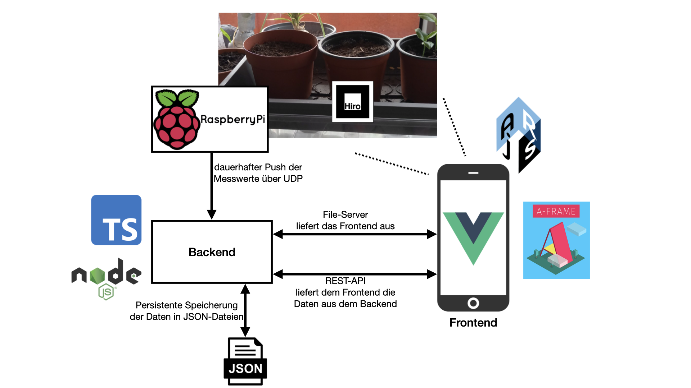
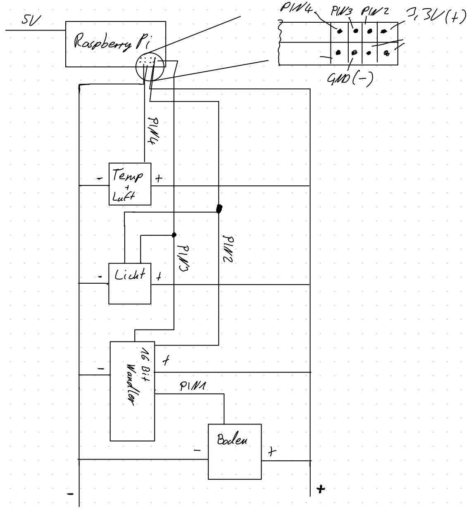

# Der Prototyp {#prototyp}

## Konzeption

### Idee

Aus dem Visionsvideo soll nun ein Prototyp entwickelt werden, der einen ersten Schritt in Richtung Realisierung der Vision darstellen soll.

Selbstverständlich sind Hologramm-Technologien, wie sie im Video gezeigt werden, noch längst nicht umsetzbar. Allerdings gibt es heute schon Möglichkeiten virtuelle Objekte in die reale Welt zu setzen und zwar in Form von Augmented Reality.

Der Aspekt, dass die Anwendung auf so ziemlich jedem Gerät laufen soll, lässt sich realisieren: Der Prototyp wird eine Web-Anwendung. Dadurch geht allerdings auch ein Aspekt verloren: Man kann dem Nutzer keine Erinnerungen/Notifications schicken, wenn er sich nicht auf der Webseite befindet. Diese Einschränkung nimmt das Team für den Prototypen aber in Kauf.

Das Erkennen von Pflanzen und ihrem Zustand anhand von Scans bzw. Bildern ist zwar prinzipiell möglich, allerdings sind solche Analysesysteme sehr aufwendig und brauchen sehr viele Testdaten, um richtig funktionieren zu können. Das würde den Projektrahmen sprengen. Daher wird der Prototyp nur mit einem Anzuchtkasten umgesetzt, in den zusätzlich Sensoren eingebaut werden.

Zusammengefasst soll also eine AR-Anwendung im Webbrowser realisiert werden, die mit einem Anzuchtkasten funktioniert. In den Anzuchtkasten werden Sensoren eingebaut, die den Zustand im Kasten erfassen. Über mobile Endgeräte erfolgt nun die Überlagerung von virtuellen Objekten in die reale Welt, gestützt durch die Messwerte der Sensoren.

### Design

Das daraus abgeleitete Design findet sich in der Grafik wieder. Alternativ befindet es sich ebenfalls im [Anhang](#anhang).


Die Messdaten der Sensoren werden unterschieden in **übergreifende** und **spezifische** Messdaten. Luftfeuchtigkeit, Belichtung und Temperatur gelten für alle Pflanzen im Kasten gleich, darum werden sie auch in der Darstellung an den Kasten angehängt und direkt im Startmenü angezeigt. Lediglich die Bodenfeuchtigkeit gilt spezifisch für jeden Topf einzeln, der User muss diesen Topf also zunächst im Startmenü auswählen, um sich dessen gesamte Daten unter der Menüoption "Standortdaten" anzeigen zu lassen.

Außerdem unterschieden werden muss zwischen einem leeren und einem bepflanzten Topf. Je nachdem wie diese Zustandseigenschaft des Topfes belegt ist, ergeben sich bei der Auswahl dessen nämlich auch weitere zu unterscheidende Menü- und Aktivitäts-Optionen. Diese lassen sich der Ablauf-Grafik entnehmen.

Übergreifende Messdaten werden über dem Kasten als türkise Buttons dargestellt. Durch Antippen wird zum jeweiligen Messwert ein Diagramm angezeigt, welches den Verlauf über die letzten Tage visualisiert.

Umfangreichere Inhalte wie Informationen zu einer Pflanze oder auch die Diagramme werden in einem weißen Popup dargestellt, welches sich auf den Bildschirm legt und die AR-Szene überdeckt. Das Popup ist am Bildschirm fest und nicht am Kasten. Er ist scrollbar und kann über ein X geschlossen werden.

Wichtige Notifications, welche in der Grafik rot dargestellte Symbole sind, erscheinen, falls ein nötiger Handlungsbedarf besteht (z.B. wenn die Erde der Pflanze zu trocken ist), am jeweiligen Topf. Durch Antippen sollen diese direkt zu einer entsprechenden Popup-Nachricht führen und zu der erforderlichen Aktion im Menü navigieren.

Popup-Nachrichten sind immer unten zu sehen in Form von Sprechblasen, die von PLANT-E "gesprochen" werden. Diese Popup-Nachrichten sollen auch die Anweisungen z.B. für das Eintopfen darstellen. Dies soll die Kommunikation von PLANT-E mit dem Nutzer visualisieren.

## Architektur

Aus diesen Anforderungen ist eine Architektur entstanden, die aus drei Kernkomponenten besteht:

- dem Sensorenhandling über einen Raspberry Pi,
- der Datenverwaltung und Auslieferung der Webseite über einen Backend-Server und
- die eigentliche Webseite, die von den Clients aufgerufen wird.

Zur Übersicht ist ebenfalls ein Diagramm erstellt worden, welches die Komponenten und ihr Zusammenspiel verdeutlicht.



Die Sensordaten werden stetig gemessen und vom Raspberry Pi über UDP-Pakete an das Backend gesendet. UDP ist ein verbindungsloses Protokoll. Es werden lediglich Zieladresse und -port angegeben und schon wird das Datenpaket versendet. Es findet keine Empfangsbestätigung statt. Die Pakete sind immer kleine abgeschlossene Einheiten. Die Idee ist, dass die Sensordaten in einem langen konstanten Datenstrom ausgeliefert werden, egal ob jemand diese Daten entgegennimmt oder nicht. Die Vorstellung eines Radiosenders ist ein geeigneter Vergleich. Der Vorteil dieses Vorgehens ist, dass stetig und sehr schnell Daten zur Verfügung stehen mit geringstem Overhead.

Der Backend-Server ist das Bindeglied für alle Komponenten. Er nimmt den UDP-Datenstrom des Raspberry Pis entgegen und verarbeitet diese Daten. Zum Einen werden sie für die Erfassung eines historischen Verlaufes gespeichert. Zum Anderen können die Daten vom Frontend nun abgerufen werden. Das Backend liefert immer die aktuellensten erhaltenen Daten aus. Bricht der Datenstrom vom Raspberry Pi ab, sind immer noch die zuletzt empfangenen Daten abrufbar.

Zusätzlich liefert das Backend auch die Frontend-Webseite mit allen zugehörigen Dateien aus. Darüber hinaus stellt das Backend eine REST-API zur Verfügung, die vom Frontend genutzt werden kann, um Daten abzurufen und zu senden. Die Speicherung von zusätzlichen Daten, z.B. ob ein Topf bepflanzt ist und wie lange schon, wird ebenfalls im Backend gespeichert und verwaltet. Das Backend liefert auch einen Pflanzenkatalog mit den unterstützen Pflanzenarten aus.

Das Frontend ist eine Webseite, die in jedem modernen Browser aufgerufen werden kann. Da es sich um eine AR-Anwendung handelt, benötigt der Client zwingend eine Kamera im Gerät. Die Anwendung ist nur in der Lage Informationen rund um den Kasten anzuzeigen. Zur Erkennung des Kastens ist dort ein Marker angebracht dazu – später mehr.

## Umsetzung

### Raspberry Pi

Der Raspberry Pi soll mittels Sensoren verschiedene Daten zu dem Anzuchtkasten messen und per UDP-Pakete an das Backend senden.

#### Datenformat

Die gesendeten UDP-Pakete sollen alle Messdaten im JSON-Format enthalten. Hier die Spezifikation der zu sendenden Daten:

```jsonc
{
  "timestamp": 1594639596, // unix timestamp
  "airHumidity": 42, // in Prozent, ganzzahlig
  "light": 123,      // in lux, ganzzahlig
  "temperature": 24, // in Grad, ganzzahlig
  "pots": [ // die Töpfe von links nach rechts
    {
      "soilHumidity": 73, // in Prozent, ganzzahlig
      // "size": 8,       // Höhe der Pflanze in cm
                      // ist nicht umgesetzt worden
    }
  ],
}
```

Luftfeuchtigkeit, Helligkeit und Temperatur werden für den gesamten Kasten erfasst. Die Bodenfeuchtigkeit wird für jeden Topf einzeln gemessen und ausgeliefert. Da der Gruppe nur ein Sensor für die Bodenfeuchtigkeit zur Verfügung gestellt worden ist, kann der Prototyp nur einen Topf bedienen.

Die Analyse der Wuchshöhe ist im Verlaufe des Projektes ausgeklammert worden, da keine geeignete Kamera zur Verfügung gestanden hat. Außerdem ist die Analyse von Kamerabildern ein recht aufwendiges Verfahren, was den Rahmen des Projektes gesprengt hätte.

#### Verwendete Sensoren

Zum Verarbeiten der Sensordaten wird ein Raspberry Pi 4 benutzt, da dieser der Projekt-Gruppe bereits zur Verfügung gestanden hat. Für die Sensoren ist daher die Auswahl etwas begrenzt gewesen.

- Lichtmessung: *Lichtsensor „BH1750“*
  - wandelt bereits auf der Platine die Analogsignale in Digitalsignale
- Messung von Temperatur und Luftfeuchtigkeit: *Sensor „DHT22“*
  - wandelt ebenso bereits die Signale, sodass diese ohne zusätzliche Bauteile vom Raspberry Pi gelesen werden können
- Messung der Bodenfeuchtigkeit: *„Capacitive Stil Moisture Sensor v2.0“*
  - wurde von Hardwareexperten der FH empfohlen
  - liefert unter den Feuchtigkeitssensoren wohl die präzisesten Daten
- Signalverarbeitung des Feuchtigkeitssensors: *Analog-Digital Wandler „MCP3008“*
  - wurde ebenso gewählt aufgrund der Empfehlung führender Hardwareexperten der FH

Um diese Sensoren auf dem Raspberry Pi nutzen zu können sind externe Bibliotheken nötig gewesen. Hierbei handelt es sich um: Adafruit_ADSx15[^ada], Adafruit_DHT[^dht] und smbus[^smb].

**Anmerkung zur Abgrenzung zwischen dem Gruppenprojekt "Grüni" und dem IT-Praxisprojekt von Dennis Krischal:**  
Die Projekte überschneiden sich in genau einem Punkt, da es sich angeboten hat für beide die gleiche Hardware zum Auslesen der Sensoren zu benutzen.

[^ada]: Link: <https://github.com/adafruit/Adafruit_Python_ADS1x15>
[^dht]: Link: <https://github.com/adafruit/Adafruit_Python_DHT>
[^smb]: Link: <http://wiki.erazor-zone.de/wiki:linux:python:smbus:doc>

#### Schaltplan

*siehe Grafik*



#### Skript

Die Anwendung auf dem Raspberry Pi ist als Python-Skript erstellt worden. Es liest die Sensordaten und versendet sie als UDP-Paket an den Server.

Es gibt einen Mock-Modus in dem das Skript keine Sensordaten, sondern Zufallswerte generiert und ausgibt. Das Skript kann dadurch auch auf einem beliebigen Gerät gestartet werden, liefert dann aber natürlich nur die Zufallswerte.

### Backend

Das Backend ist ein Node.js-Server, der in TypeScript implementiert worden ist. Er empfängt zum einen die UDP-Pakete vom Raspberry Pi über einen entsprechenden Socket. Zum Anderen stellt er einen Express.js Server zur Verfügung, der sowohl das Frontend inklusive aller benötigten Dateien ausliefert als auch eine REST-API für das Frontend zur Verfügung stellt.

Es speichert die Daten vom Raspberry Pi in regelmäßigen Abständen in einer Historie und speichert auch Daten, die vom Frontend kommen. Zum Beispiel in welchem Topf sich welche Pflanze befindet und wie lange die dort schon eingetopft ist usw.

Außerdem liegt ein Katalog mit den unterstützten Pflanzenarten im Backend vor. Dieser wird verwendet, um die Pflanzendaten anzureichern.

Die Daten werden in JSON-Dateien gespeichert, die beim Start des Servers geladen werden. Ändern sich die Daten, so werden die Änderungen auch in die JSON-Dateien geschrieben. Die Verwendung von einem Datenbanken-System ist für den Prototypen zu aufwendig gewesen.

### Frontend

Das Frontend besteht aus einer Webseite, die von der Funktion her eine SPA (Single-Page-Application) ist. Zum Einsatz kommt das Webframework **Vue.js** sowie die Technologien **AFrame** und **AR.js**.

**Vue.js**[^vue] ist ein schlankes Frontend-Framework, welches mit recht simplen HTML-Attributen, einem Komponenten- und Vorlagensystem das erstellen von interaktiven Webseiten vereinfacht. Es kann einfach auf die HTML-Struktur draufgesetzt werden und ist recht leichtgewichtig.

**AFrame**[^aframe] ist ein Wrapper für Three.js, mittels dem 3D-Modelle in eine Szene gesetzt und gerendert werden können. AFrame stellt dabei HTML-Tags zur Verfügung, die 3D-Elemente repräsentieren und entsprechend gerendert werden. Der Mechanismus erfolgt so, dass ein `<a-scene>`-Tag im HTML-Markup gesetzt werden muss. Diese `<a-scene>` wird dann in ein HTML-Canvas-Element umgewandelt und die 3D-Elemente (`<a-entity>`) innerhalb der `<a-scene>` werden in die Szene gesetzt und auf den Canvas gemalt. Mit diesem System lassen sich VR-Anwendungen im Webbrowser darstellen.

**AR.js**[^arjs] ist nun eine Erweiterung für AFrame. Der zugrundeliegende Mechanismus bleibt gleich, allerdings wird der Hintergrund des Canvas mit dem Bild der geräteinternen Kamera gefüllt. Zusätzlich kann ein sog. Marker definiert werden (siehe Bild). Der Marker wird vom Kamerabild erkannt und dient als Referenzpunkt. Die Position des Markers markiert den Ursprungspunkt der Szene (Punkt 0,0,0). Die Breite des Markers gibt die Breite von einer Einheit in AR.js an. Nun können 3D-Elemente relativ zum Marker platziert werden.


AR.js funktioniert so, dass die Elemente nur zu sehen sind, wenn auch der Marker zu sehen ist, zu dem die Elemente ja relativ liegen. Er dient als Referenz- und Ankerpunkt der Szene. Der Einfachheit halber ist der Standard-Marker von AR.js verwendet worden.

[^vue]: Link: <https://vuejs.org>
[^aframe]: Link: <https://aframe.io>
[^arjs]: Link: <https://ar-js-org.github.io/AR.js-Docs/>

## Ergebnisse und Herausforderungen

Die Umsetzung des Raspberry Pi, der Sensoren und des Backends hat sehr gut funktioniert. Die Daten werden richtig ausgeliefert, im Backend gespeichert und ausgegeben. Lediglich die Geschwindigkeit der Sensoren ist nicht optimal. Diese brauchen im Schnitt etwas unter einer Sekunde, um die Messdaten zu erheben und zu versenden. Dies ist für sehr interaktive Use-Cases wie zum Beispiel der Gießanzeige zwar unpraktisch, für den Prototypen ist es aber ausreichend. Hier können in Zukunft Optimierungen vorgenommen werden, etwa mit besserer Hardware.

Bezüglich des Backends fehlen natürlich reale, über einen längeren Zeitraum erhobene Daten. Wären diese vorhanden, könnten sich noch neue Erkenntnisse gewinnen und zum Beispiel eine sehr umfangreiche Historie mit vielen Optionen und Ansichten erzeugen lassen. Für einen Protoypen sind die vorhandenen Daten aber ausreichend.

Sehr ernüchternd ist hingegen das Frontend ausgefallen. Die anfängliche Euphorie über die AR-Technik im Browser ist sehr schnell verflogen, weil sich sehr bald gravierende Schwierigkeiten ergeben haben. Der Projektfortschritt ist dadurch so stark behindert worden, dass nur ein Bruchteil der geplanten Funktionalität überhaupt umgesetzt werden konnte.

Ein großes Problem, welches immernoch nicht abschließend gelöst werden konnte, ist das Anklicken von Elementen in AR.js. Es hat sehr lange gedauert, bis es überhaupt möglich gewesen ist, auf Klicks zu reagieren. Das hängt damit zusammen, dass Klicks in der Szene über einen Raycaster umgesetzt werden. Dieser Raycaster ist in der Standard-Konfiguration zu langsam. Da im AR-Modus die Szene ständig verschoben wird, aufgrund des wackelnden Markers durch die wackelige Hand des Nutzers, muss der Raycaster sehr schnell immer wieder nach Kollisionen checken, ansonsten werden niemals irgendwelche Klicks erkannt. Diese Erkenntnis zu gewinnen und das Problem zu lösen, hat alleine 2 Wochen in Anspruch genommen.

Damit nicht genug funktionieren Klicks im AR-Modus nur in der Mitte des Bildschirms einigermaßen zuverlässig. Weiter am Rand funktionieren sie so gut wie gar nicht. Die genaue Ursache ist bis heute nicht geklärt worden. Durch das Wackeln werden zusätzlich manchmal Element angeklickt, die man gar nicht klicken wollte. Insgesamt ist das Interagieren mit der AR-Anwendung sehr mühselig und ist alles andere als intuitiv und ausgereift.

Auch die Erkennung des Markers in AR.js funktioniert nur unter guten Lichtverhältnissen und freie Sicht der Kamera auf den Marker. Wird der Marker verloren, so verschwinden einfach alle 3D-Elemente. Dies stellt keine schöne User Experience dar und ist gerade für die Entwicklung sehr anstrengend.

Deswegen ist während der Entwicklung der AR-Modus meistens ausgeschaltet gewesen. Die App wurde hauptsächlich im VR-Modus entwickelt, da hier nichts wackelt und die Entwickler besser testen können, was sie eigentlich tun. Daher funktioniert die Anwendung im VR-Modus recht gut, im AR-Modus eher weniger.

Auch im Design sind die Möglichkeiten von AFrame und AR.js sehr beschränkt. So ist es nicht möglich zum Beispiel die Ecken von einem Button abzurunden. Das komplette Design hat eigentlich auf "Kapseln" basiert. Da sich dies nicht realisieren lassen hat, sind überall langgezogene Kreise und Kugeln zum Einsatz gekommen. Das Erstellen oder Verändern von eigenen Geometrien und Meshes ist schwerlich möglich, da AFrame dafür keinen Editor oder Oberfläche bietet, wie man es z.B. von Unity kennt.

Das Darstellen von Text in der Szene ist ebenfalls mit Schwierigkeiten verbunden. So werden von AFrame keine Sonderzeichen oder Umlaute unterstützt. Auch ein "ß" kann nicht dargestellt werden. Dies ist besonders für eine Anwendung in deutscher Sprache ein großes Manko. Ebenso problematisch ist das Rendern von Texten variabler Länge, da AFrame zwar ein Auto-Scaling für Texte unterstützt, dies aber nur mit den simpelsten Elementen zusammen verwendet werden kann. Die Grenzen dieser Technologie sind sehr schnell erreicht.

Das gravierendste Problem ist das nicht vorhandene Logging von Fehlern in AFrame und AR.js. Fehler in der Syntax werden nicht angezeigt und auch beim Auftreten von Fehlern während des Aufrufens der Seite, gibt es so gut wie keine Logs oder Hinweise. Die Entwickler tappen die ganze Zeit im Dunkeln und können sich nur durch kleine Änderungen und stetiges Ausprobieren im Browser langsam voranbewegen. Gibt die Dokumentation von AFrame wenigstens noch einen guten Überblick, so ist sie für AR.js viel zu lückenhaft, um damit ordentlich arbeiten zu können. Insgesamt ist die Entwicklung mit diesen Technologien sehr zäh gewesen und hat alles andere als zufriedenstellende Ergebnisse produziert.

Das Projekt ist auch durch die Vielzahl an unterschiedlichen Komponenten sehr komplex gewesen. Dieses Zusammenspiel hat sich aber durch Mocking und Fake-Daten recht elegant lösen lassen. Trotzdem hat das beschwerliche Arbeiten im Frontend dazu geführt, dass viele Funktionalitäten zwar theoretisch über Raspberry Pi und Backend zur Verfügung stehen, diese aber im Frontend nicht umgesetzt werden konnten. Tatsächlich sind die Sensoren und das Backend dem Frontend weit voraus. Dies ist für das Projektteam besonders frustrierend, da ja theoretisch mehr funktioniert, aber das Frontend nicht in der Lage ist, das darzustellen.
